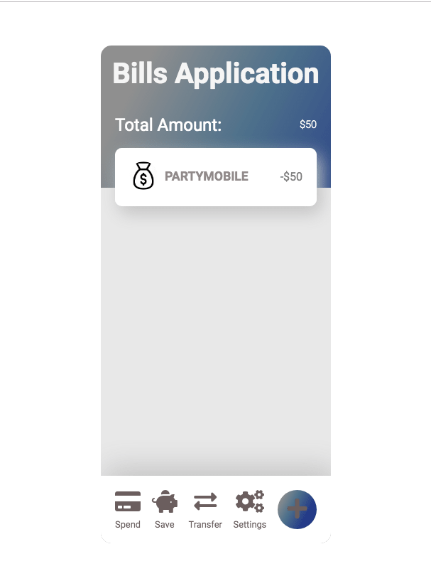

!

## REACT Training app!

I developed this 3-in-1, along with another colleauge to further solidify our knowledge of React and its' advanced concepts, such as Hooks, Redux, and other ways to alter state in applications. This could serve as a great way for beginner React developers to understand the state of an application, and can also help solidify ES6 skills as well!

## How to view

Clone this application to your desktop, and run npm install to install all dependencies.
After dependencies are installed, run npm run watch to view in your web browser. To switch between the different applications, simply uncomment the corresponding project in the main app.js file.

